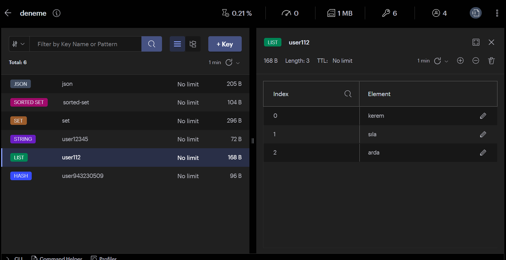

# redis-database-caching-pub-sub

> Redis caching database and pub sub topics have been studied.

## Table of Contents

  - [Table of Contents](#table-of-contents)
  - [General Information](#general-information)
  - [Technologies Used](#technologies-used)
  - [Features](#features)
  - [Screenshots](#screenshots)
  - [Setup](#setup)
-   [SetupCaching](#SetupCaching)
  - [UsageCaching](#UsageCaching)
  - [Project Status](#project-status)
  - [Contact](#contact)
<!-- * [License](#license) -->


## General Information
- The general purpose of the project is to understand redis and make small examples, and also to see the redis database data types we used before


## Technologies Used
  


## Features
List the ready features here:
- Redis Database and data type
- Redis Caching
- Redis pub/sub


## Screenshots



## Setup

```sh
npm init -y
npm install 
```
## Setup redis database module for redisJSON

- redis is a structure that also works on linux. Open Ubuntu shell

- The following packages are required to successfully build on Ubuntu 20.04:

```sh
  git clone https://github.com/RedisJSON/RedisJSON.git

```
```sh
  cd RedisJSON 
```
```sh
  sudo apt install build-essential llvm cmake libclang1 libclang-dev cargo
  cargo build --release
```
- Requirements:

    -  Redis v6.0 or above
- you can have Redis load the module using the following command line argument syntax:

```sh
 redis-server --loadmodule ./target/release/librejson.so
```

- check that it is loaded

```sh
 127.0.0.1:6379> JSON.SET num $ 0
OK
127.0.0.1:6379> JSON.NUMINCRBY num $ 1
"[1]"
127.0.0.1:6379> JSON.NUMINCRBY num $ 1.5
"[2.5]"
127.0.0.1:6379> JSON.NUMINCRBY num $ -0.75
"[1.75]"
127.0.0.1:6379> JSON.NUMMULTBY num $ 24
"[42]"
```


## Usage

```sh
 const { createClient } =  require('redis');

const client = createClient();


  router.get("/redis/list", async (req, res) => {
        try {
            await client.lPush("user112", ["arda", "sıla", "kerem"])
            await client.lInsert("user112", "AFTER", "sıla", ["recep"])
    
            await client.rPush("user112", ["şemşi"])
            await client.rPop("user112") //delete
            const value = await client.lRange("user112", 0, -1) //list all
            const droppedLeft = await client.lPopCount("user112", 2) 

            if (droppedLeft) {
                res.status(200).json({ message: `silinen değerler ${droppedLeft}` })
            } else {
                res.status(200).json({ message: `silinen değerler yok ` })
            }
        } catch (err) {

            res.status(500).json({ message: err.message })
        }
    })
```

## SetupCaching


## UsageCaching

## Contact
Created by [@nurettinsen](https://www.linkedin.com/in/nurettin-sen/) - feel free to contact me!

